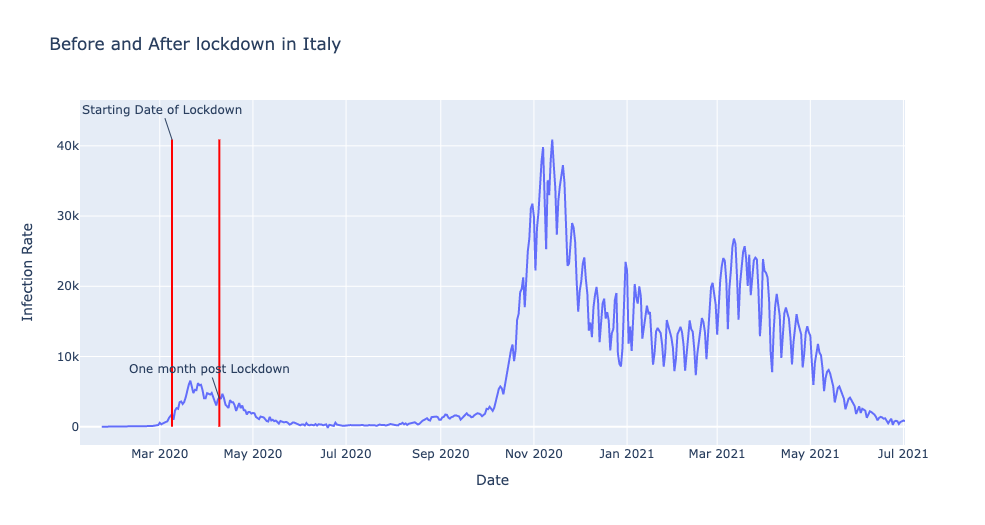
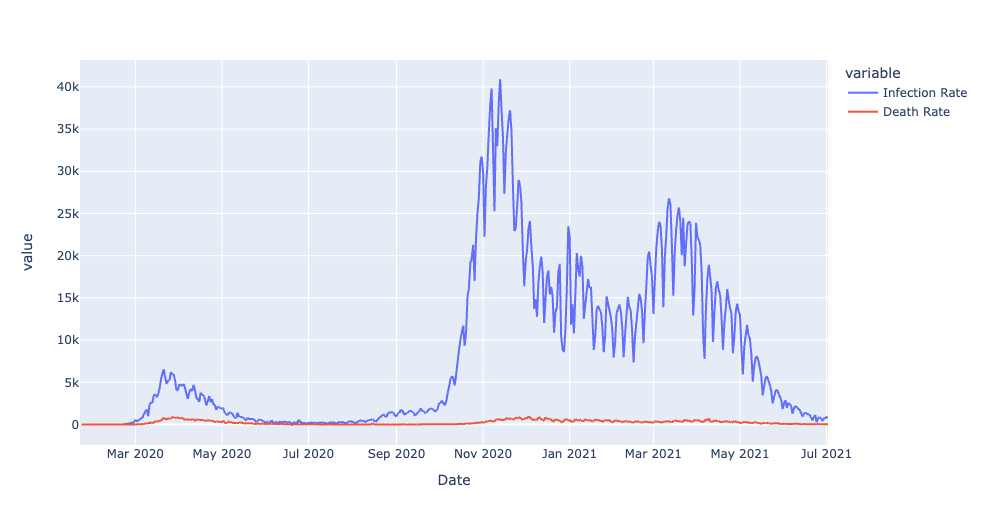
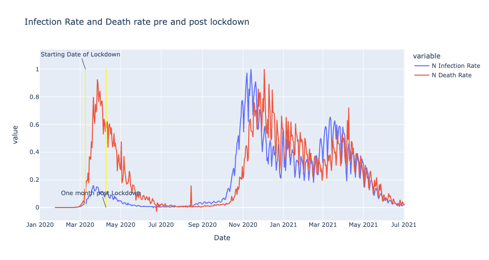

### Covid 19 analysis using Python

We use Python to animate the spread of covid around the world. Then we focus on a few countries and see how the impact of lockdown has affected the spread of covid in that country. We further see how the infection rates and death rates are correlated.


---


### Importing modules

### Task 1


```python
import pandas as pd
import numpy as np
import plotly.express as px
import matplotlib.pyplot as plt 
print('modules are imported')
```

    modules are imported


### Task 1.1: 
#### Loading the Dataset


```python
dataset_url = 'https://raw.githubusercontent.com/datasets/covid-19/main/data/countries-aggregated.csv'
fname = 'data/countries-aggregated.csv'
df = pd.read_csv(fname)
```


```python
df_31May21 = df[df.Date == '2020-05-31']
```


```python
df_31May21.head()
```


<div>
<style scoped>
    .dataframe tbody tr th:only-of-type {
        vertical-align: middle;
    }

    .dataframe tbody tr th {
        vertical-align: top;
    }

    .dataframe thead th {
        text-align: right;
    }
</style>
<table border="1" class="dataframe">
  <thead>
    <tr style="text-align: right;">
      <th></th>
      <th>Date</th>
      <th>Country</th>
      <th>Confirmed</th>
      <th>Recovered</th>
      <th>Deaths</th>
    </tr>
  </thead>
  <tbody>
    <tr>
      <th>130</th>
      <td>2020-05-31</td>
      <td>Afghanistan</td>
      <td>15208</td>
      <td>1328</td>
      <td>258</td>
    </tr>
    <tr>
      <th>658</th>
      <td>2020-05-31</td>
      <td>Albania</td>
      <td>1137</td>
      <td>872</td>
      <td>33</td>
    </tr>
    <tr>
      <th>1186</th>
      <td>2020-05-31</td>
      <td>Algeria</td>
      <td>9394</td>
      <td>5748</td>
      <td>653</td>
    </tr>
    <tr>
      <th>1714</th>
      <td>2020-05-31</td>
      <td>Andorra</td>
      <td>764</td>
      <td>694</td>
      <td>51</td>
    </tr>
    <tr>
      <th>2242</th>
      <td>2020-05-31</td>
      <td>Angola</td>
      <td>86</td>
      <td>18</td>
      <td>4</td>
    </tr>
  </tbody>
</table>
</div>


### Task 1.2:
#### let's check the dataframe 


```python
df_31May21.head()
```


<div>
<style scoped>
    .dataframe tbody tr th:only-of-type {
        vertical-align: middle;
    }

    .dataframe tbody tr th {
        vertical-align: top;
    }

    .dataframe thead th {
        text-align: right;
    }
</style>
<table border="1" class="dataframe">
  <thead>
    <tr style="text-align: right;">
      <th></th>
      <th>Date</th>
      <th>Country</th>
      <th>Confirmed</th>
      <th>Recovered</th>
      <th>Deaths</th>
    </tr>
  </thead>
  <tbody>
    <tr>
      <th>130</th>
      <td>2020-05-31</td>
      <td>Afghanistan</td>
      <td>15208</td>
      <td>1328</td>
      <td>258</td>
    </tr>
    <tr>
      <th>658</th>
      <td>2020-05-31</td>
      <td>Albania</td>
      <td>1137</td>
      <td>872</td>
      <td>33</td>
    </tr>
    <tr>
      <th>1186</th>
      <td>2020-05-31</td>
      <td>Algeria</td>
      <td>9394</td>
      <td>5748</td>
      <td>653</td>
    </tr>
    <tr>
      <th>1714</th>
      <td>2020-05-31</td>
      <td>Andorra</td>
      <td>764</td>
      <td>694</td>
      <td>51</td>
    </tr>
    <tr>
      <th>2242</th>
      <td>2020-05-31</td>
      <td>Angola</td>
      <td>86</td>
      <td>18</td>
      <td>4</td>
    </tr>
  </tbody>
</table>
</div>


```python
df_31May21.tail()
```


<div>
<style scoped>
    .dataframe tbody tr th:only-of-type {
        vertical-align: middle;
    }

    .dataframe tbody tr th {
        vertical-align: top;
    }

    .dataframe thead th {
        text-align: right;
    }
</style>
<table border="1" class="dataframe">
  <thead>
    <tr style="text-align: right;">
      <th></th>
      <th>Date</th>
      <th>Country</th>
      <th>Confirmed</th>
      <th>Recovered</th>
      <th>Deaths</th>
    </tr>
  </thead>
  <tbody>
    <tr>
      <th>100450</th>
      <td>2020-05-31</td>
      <td>Vietnam</td>
      <td>328</td>
      <td>279</td>
      <td>0</td>
    </tr>
    <tr>
      <th>100978</th>
      <td>2020-05-31</td>
      <td>West Bank and Gaza</td>
      <td>448</td>
      <td>372</td>
      <td>3</td>
    </tr>
    <tr>
      <th>101506</th>
      <td>2020-05-31</td>
      <td>Yemen</td>
      <td>323</td>
      <td>14</td>
      <td>80</td>
    </tr>
    <tr>
      <th>102034</th>
      <td>2020-05-31</td>
      <td>Zambia</td>
      <td>1057</td>
      <td>779</td>
      <td>7</td>
    </tr>
    <tr>
      <th>102562</th>
      <td>2020-05-31</td>
      <td>Zimbabwe</td>
      <td>178</td>
      <td>29</td>
      <td>4</td>
    </tr>
  </tbody>
</table>
</div>


#### let's check the shape of the dataframe 


```python
df_31May21.shape
```


    (195, 5)


```python
df.shape
```


    (102960, 5)


### Task 2.1 :
#### let's do some preprocessing 


```python
dfconf=df[df.Confirmed>0]
```


```python
dfconf.head()
```


<div>
<style scoped>
    .dataframe tbody tr th:only-of-type {
        vertical-align: middle;
    }

    .dataframe tbody tr th {
        vertical-align: top;
    }

    .dataframe thead th {
        text-align: right;
    }
</style>
<table border="1" class="dataframe">
  <thead>
    <tr style="text-align: right;">
      <th></th>
      <th>Date</th>
      <th>Country</th>
      <th>Confirmed</th>
      <th>Recovered</th>
      <th>Deaths</th>
    </tr>
  </thead>
  <tbody>
    <tr>
      <th>33</th>
      <td>2020-02-24</td>
      <td>Afghanistan</td>
      <td>1</td>
      <td>0</td>
      <td>0</td>
    </tr>
    <tr>
      <th>34</th>
      <td>2020-02-25</td>
      <td>Afghanistan</td>
      <td>1</td>
      <td>0</td>
      <td>0</td>
    </tr>
    <tr>
      <th>35</th>
      <td>2020-02-26</td>
      <td>Afghanistan</td>
      <td>1</td>
      <td>0</td>
      <td>0</td>
    </tr>
    <tr>
      <th>36</th>
      <td>2020-02-27</td>
      <td>Afghanistan</td>
      <td>1</td>
      <td>0</td>
      <td>0</td>
    </tr>
    <tr>
      <th>37</th>
      <td>2020-02-28</td>
      <td>Afghanistan</td>
      <td>1</td>
      <td>0</td>
      <td>0</td>
    </tr>
  </tbody>
</table>
</div>


```python
dfconf.shape
```


    (91970, 5)


#### let's see data related to a country for example Italy 


```python
dfconf[dfconf.Country=='Italy'].head(10)
```


<div>
<style scoped>
    .dataframe tbody tr th:only-of-type {
        vertical-align: middle;
    }

    .dataframe tbody tr th {
        vertical-align: top;
    }

    .dataframe thead th {
        text-align: right;
    }
</style>
<table border="1" class="dataframe">
  <thead>
    <tr style="text-align: right;">
      <th></th>
      <th>Date</th>
      <th>Country</th>
      <th>Confirmed</th>
      <th>Recovered</th>
      <th>Deaths</th>
    </tr>
  </thead>
  <tbody>
    <tr>
      <th>44889</th>
      <td>2020-01-31</td>
      <td>Italy</td>
      <td>2</td>
      <td>0</td>
      <td>0</td>
    </tr>
    <tr>
      <th>44890</th>
      <td>2020-02-01</td>
      <td>Italy</td>
      <td>2</td>
      <td>0</td>
      <td>0</td>
    </tr>
    <tr>
      <th>44891</th>
      <td>2020-02-02</td>
      <td>Italy</td>
      <td>2</td>
      <td>0</td>
      <td>0</td>
    </tr>
    <tr>
      <th>44892</th>
      <td>2020-02-03</td>
      <td>Italy</td>
      <td>2</td>
      <td>0</td>
      <td>0</td>
    </tr>
    <tr>
      <th>44893</th>
      <td>2020-02-04</td>
      <td>Italy</td>
      <td>2</td>
      <td>0</td>
      <td>0</td>
    </tr>
    <tr>
      <th>44894</th>
      <td>2020-02-05</td>
      <td>Italy</td>
      <td>2</td>
      <td>0</td>
      <td>0</td>
    </tr>
    <tr>
      <th>44895</th>
      <td>2020-02-06</td>
      <td>Italy</td>
      <td>2</td>
      <td>0</td>
      <td>0</td>
    </tr>
    <tr>
      <th>44896</th>
      <td>2020-02-07</td>
      <td>Italy</td>
      <td>3</td>
      <td>0</td>
      <td>0</td>
    </tr>
    <tr>
      <th>44897</th>
      <td>2020-02-08</td>
      <td>Italy</td>
      <td>3</td>
      <td>0</td>
      <td>0</td>
    </tr>
    <tr>
      <th>44898</th>
      <td>2020-02-09</td>
      <td>Italy</td>
      <td>3</td>
      <td>0</td>
      <td>0</td>
    </tr>
  </tbody>
</table>
</div>


#### let's see Global spread of Covid19

## Code:

```python
fig = px.choropleth(dfconf, locations='Country', locationmode='country names', color='Confirmed', animation_frame='Date')
fig.layout.updatemenus[0].buttons[0].args[1]['frame']['duration'] = 30
fig.layout.updatemenus[0].buttons[0].args[1]['transition']['duration'] = 5
fig.update_geos(projection_type="equirectangular", visible=True, resolution=50)
fig.update_layout(
    title_text = 'Global Spread of Coronavirus',
    title_x = 0.5,
    geo=dict(
        showframe = False,
        showcoastlines = False,
    ))
#fig.show()
iplot(fig,show_link=False)
pio.write_json(fig,"file001.json",engine="json")
fig.write_html("plot001.html")
```

## Chart 1: Global Spread of Covid over Time


Example of Infection rate in China:


# Chart 2:


 <!--  -->
 <!-- <iframe
       src="https://github.com/saif-sayeed/resume-demo/blob/master/content/post/covid_analysis_python/ch001.html"
       width="90%"
       height="500px"
       style="border:none;">
 </iframe> -->---
#### let's see Global spread of Covid19
title: Chk Part 02
---


### Let's see Global deaths of Covid19


```python
dfdeaths=df[df.Deaths>0]
```


```python
dfdeaths.head()
```


<div>
<style scoped>
    .dataframe tbody tr th:only-of-type {
        vertical-align: middle;
    }

    .dataframe tbody tr th {
        vertical-align: top;
    }

    .dataframe thead th {
        text-align: right;
    }
</style>
<table border="1" class="dataframe">
  <thead>
    <tr style="text-align: right;">
      <th></th>
      <th>Date</th>
      <th>Country</th>
      <th>Confirmed</th>
      <th>Recovered</th>
      <th>Deaths</th>
    </tr>
  </thead>
  <tbody>
    <tr>
      <th>60</th>
      <td>2020-03-22</td>
      <td>Afghanistan</td>
      <td>34</td>
      <td>1</td>
      <td>1</td>
    </tr>
    <tr>
      <th>61</th>
      <td>2020-03-23</td>
      <td>Afghanistan</td>
      <td>41</td>
      <td>1</td>
      <td>1</td>
    </tr>
    <tr>
      <th>62</th>
      <td>2020-03-24</td>
      <td>Afghanistan</td>
      <td>43</td>
      <td>1</td>
      <td>1</td>
    </tr>
    <tr>
      <th>63</th>
      <td>2020-03-25</td>
      <td>Afghanistan</td>
      <td>76</td>
      <td>2</td>
      <td>2</td>
    </tr>
    <tr>
      <th>64</th>
      <td>2020-03-26</td>
      <td>Afghanistan</td>
      <td>80</td>
      <td>2</td>
      <td>3</td>
    </tr>
  </tbody>
</table>
</div>


```python
dfdeaths.shape
```


    (81987, 5)


## Chart 2: Global Deaths from Covid


title: Chk Part 03
---


### Let's Visualize how intensive the Covid19 Transmission has been in each of the country
let's start with an example:


```python
df_china=df[df.Country == 'China']
```


```python
import pandas as pd
import numpy as np
import plotly.express as px
import matplotlib.pyplot as plt 
print('modules are imported')
```

    modules are imported


```python
df_china.head()
```


<div>
<style scoped>
    .dataframe tbody tr th:only-of-type {
        vertical-align: middle;
    }

    .dataframe tbody tr th {
        vertical-align: top;
    }

    .dataframe thead th {
        text-align: right;
    }
</style>
<table border="1" class="dataframe">
  <thead>
    <tr style="text-align: right;">
      <th></th>
      <th>Date</th>
      <th>Country</th>
      <th>Confirmed</th>
      <th>Recovered</th>
      <th>Deaths</th>
    </tr>
  </thead>
  <tbody>
    <tr>
      <th>19008</th>
      <td>2020-01-22</td>
      <td>China</td>
      <td>548</td>
      <td>28</td>
      <td>17</td>
    </tr>
    <tr>
      <th>19009</th>
      <td>2020-01-23</td>
      <td>China</td>
      <td>643</td>
      <td>30</td>
      <td>18</td>
    </tr>
    <tr>
      <th>19010</th>
      <td>2020-01-24</td>
      <td>China</td>
      <td>920</td>
      <td>36</td>
      <td>26</td>
    </tr>
    <tr>
      <th>19011</th>
      <td>2020-01-25</td>
      <td>China</td>
      <td>1406</td>
      <td>39</td>
      <td>42</td>
    </tr>
    <tr>
      <th>19012</th>
      <td>2020-01-26</td>
      <td>China</td>
      <td>2075</td>
      <td>49</td>
      <td>56</td>
    </tr>
  </tbody>
</table>
</div>


let's select the columns that we need


```python
df_china=df_china[['Date','Confirmed']]
```


```python
df_china.head()
```


<div>
<style scoped>
    .dataframe tbody tr th:only-of-type {
        vertical-align: middle;
    }

    .dataframe tbody tr th {
        vertical-align: top;
    }

    .dataframe thead th {
        text-align: right;
    }
</style>
<table border="1" class="dataframe">
  <thead>
    <tr style="text-align: right;">
      <th></th>
      <th>Date</th>
      <th>Confirmed</th>
    </tr>
  </thead>
  <tbody>
    <tr>
      <th>19008</th>
      <td>2020-01-22</td>
      <td>548</td>
    </tr>
    <tr>
      <th>19009</th>
      <td>2020-01-23</td>
      <td>643</td>
    </tr>
    <tr>
      <th>19010</th>
      <td>2020-01-24</td>
      <td>920</td>
    </tr>
    <tr>
      <th>19011</th>
      <td>2020-01-25</td>
      <td>1406</td>
    </tr>
    <tr>
      <th>19012</th>
      <td>2020-01-26</td>
      <td>2075</td>
    </tr>
  </tbody>
</table>
</div>


calculating the first derivation of confrimed column


```python
df_china['Infection Rate']=df_china['Confirmed'].diff()
```


```python
df_china.head()
```


<div>
<style scoped>
    .dataframe tbody tr th:only-of-type {
        vertical-align: middle;
    }

    .dataframe tbody tr th {
        vertical-align: top;
    }

    .dataframe thead th {
        text-align: right;
    }
</style>
<table border="1" class="dataframe">
  <thead>
    <tr style="text-align: right;">
      <th></th>
      <th>Date</th>
      <th>Confirmed</th>
      <th>Infection Rate</th>
    </tr>
  </thead>
  <tbody>
    <tr>
      <th>19008</th>
      <td>2020-01-22</td>
      <td>548</td>
      <td>NaN</td>
    </tr>
    <tr>
      <th>19009</th>
      <td>2020-01-23</td>
      <td>643</td>
      <td>95.0</td>
    </tr>
    <tr>
      <th>19010</th>
      <td>2020-01-24</td>
      <td>920</td>
      <td>277.0</td>
    </tr>
    <tr>
      <th>19011</th>
      <td>2020-01-25</td>
      <td>1406</td>
      <td>486.0</td>
    </tr>
    <tr>
      <th>19012</th>
      <td>2020-01-26</td>
      <td>2075</td>
      <td>669.0</td>
    </tr>
  </tbody>
</table>
</div>


```python
#px.line(df_china, x='Date', y=['Confirmed', 'Infection Rate'])

```


```python
df_china['Infection Rate'].max()
```


    15136.0


### Task 3.2:
#### Let's Calculate Maximum infection rate for all of the countries


```python
df.head()
```


<div>
<style scoped>
    .dataframe tbody tr th:only-of-type {
        vertical-align: middle;
    }

    .dataframe tbody tr th {
        vertical-align: top;
    }

    .dataframe thead th {
        text-align: right;
    }
</style>
<table border="1" class="dataframe">
  <thead>
    <tr style="text-align: right;">
      <th></th>
      <th>Date</th>
      <th>Country</th>
      <th>Confirmed</th>
      <th>Recovered</th>
      <th>Deaths</th>
    </tr>
  </thead>
  <tbody>
    <tr>
      <th>0</th>
      <td>2020-01-22</td>
      <td>Afghanistan</td>
      <td>0</td>
      <td>0</td>
      <td>0</td>
    </tr>
    <tr>
      <th>1</th>
      <td>2020-01-23</td>
      <td>Afghanistan</td>
      <td>0</td>
      <td>0</td>
      <td>0</td>
    </tr>
    <tr>
      <th>2</th>
      <td>2020-01-24</td>
      <td>Afghanistan</td>
      <td>0</td>
      <td>0</td>
      <td>0</td>
    </tr>
    <tr>
      <th>3</th>
      <td>2020-01-25</td>
      <td>Afghanistan</td>
      <td>0</td>
      <td>0</td>
      <td>0</td>
    </tr>
    <tr>
      <th>4</th>
      <td>2020-01-26</td>
      <td>Afghanistan</td>
      <td>0</td>
      <td>0</td>
      <td>0</td>
    </tr>
  </tbody>
</table>
</div>


```python
countries=list(df['Country'].unique())
#countries
```


```python
countries=list(df['Country'].unique())


```


```python
max_infection_rate=[]
for c in countries :
    MIR = df[df.Country == c].Confirmed.diff().max()
    max_infection_rate.append(MIR)
#print(max_infection_rate)


```

### Task 3.3:
#### let's create a new Dataframe 


```python
df_MIR=pd.DataFrame()
df_MIR['Country'] = countries
df_MIR['Max Infection Rate'] = max_infection_rate
df_MIR.head()
```


<div>
<style scoped>
    .dataframe tbody tr th:only-of-type {
        vertical-align: middle;
    }

    .dataframe tbody tr th {
        vertical-align: top;
    }

    .dataframe thead th {
        text-align: right;
    }
</style>
<table border="1" class="dataframe">
  <thead>
    <tr style="text-align: right;">
      <th></th>
      <th>Country</th>
      <th>Max Infection Rate</th>
    </tr>
  </thead>
  <tbody>
    <tr>
      <th>0</th>
      <td>Afghanistan</td>
      <td>5168.0</td>
    </tr>
    <tr>
      <th>1</th>
      <td>Albania</td>
      <td>1239.0</td>
    </tr>
    <tr>
      <th>2</th>
      <td>Algeria</td>
      <td>1133.0</td>
    </tr>
    <tr>
      <th>3</th>
      <td>Andorra</td>
      <td>299.0</td>
    </tr>
    <tr>
      <th>4</th>
      <td>Angola</td>
      <td>405.0</td>
    </tr>
  </tbody>
</table>
</div>


#### Let's plot the barchart : maximum infection rate of each country


```python
#px.bar(df_MIR, x='Country', y='Max Infection Rate', color='Country', title='global maximum infection rate', log_y=True) 
```


```python
#log to increase the quALITY FOR low bars - changes scale for y axis
```

### Task 4: Let's See how National Lockdowns Impacts Covid19 transmission in Italy

### COVID19 pandemic lockdown in Italy 
On 9 March 2020, the government of Italy under Prime Minister Giuseppe Conte imposed a national quarantine, restricting the movement of the population except for necessity, work, and health circumstances, in response to the growing pandemic of COVID-19 in the country. <a href="https://en.wikipedia.org/wiki/COVID-19_pandemic_lockdown_in_Italy#:~:text=On%209%20March%202020%2C%20the,COVID%2D19%20in%20the%20country.">source</a>


```python
italy_lockdown_start_date = '2020-03-09'
italy_lockdown_a_month_later = '2020-04-09'
```


```python
df.head()
```


<div>
<style scoped>
    .dataframe tbody tr th:only-of-type {
        vertical-align: middle;
    }

    .dataframe tbody tr th {
        vertical-align: top;
    }

    .dataframe thead th {
        text-align: right;
    }
</style>
<table border="1" class="dataframe">
  <thead>
    <tr style="text-align: right;">
      <th></th>
      <th>Date</th>
      <th>Country</th>
      <th>Confirmed</th>
      <th>Recovered</th>
      <th>Deaths</th>
    </tr>
  </thead>
  <tbody>
    <tr>
      <th>0</th>
      <td>2020-01-22</td>
      <td>Afghanistan</td>
      <td>0</td>
      <td>0</td>
      <td>0</td>
    </tr>
    <tr>
      <th>1</th>
      <td>2020-01-23</td>
      <td>Afghanistan</td>
      <td>0</td>
      <td>0</td>
      <td>0</td>
    </tr>
    <tr>
      <th>2</th>
      <td>2020-01-24</td>
      <td>Afghanistan</td>
      <td>0</td>
      <td>0</td>
      <td>0</td>
    </tr>
    <tr>
      <th>3</th>
      <td>2020-01-25</td>
      <td>Afghanistan</td>
      <td>0</td>
      <td>0</td>
      <td>0</td>
    </tr>
    <tr>
      <th>4</th>
      <td>2020-01-26</td>
      <td>Afghanistan</td>
      <td>0</td>
      <td>0</td>
      <td>0</td>
    </tr>
  </tbody>
</table>
</div>


let's get data related to italy


```python
df_italy=df[df.Country=='Italy']
```

lets check the dataframe


```python
df_italy.head()
```


<div>
<style scoped>
    .dataframe tbody tr th:only-of-type {
        vertical-align: middle;
    }

    .dataframe tbody tr th {
        vertical-align: top;
    }

    .dataframe thead th {
        text-align: right;
    }
</style>
<table border="1" class="dataframe">
  <thead>
    <tr style="text-align: right;">
      <th></th>
      <th>Date</th>
      <th>Country</th>
      <th>Confirmed</th>
      <th>Recovered</th>
      <th>Deaths</th>
    </tr>
  </thead>
  <tbody>
    <tr>
      <th>44880</th>
      <td>2020-01-22</td>
      <td>Italy</td>
      <td>0</td>
      <td>0</td>
      <td>0</td>
    </tr>
    <tr>
      <th>44881</th>
      <td>2020-01-23</td>
      <td>Italy</td>
      <td>0</td>
      <td>0</td>
      <td>0</td>
    </tr>
    <tr>
      <th>44882</th>
      <td>2020-01-24</td>
      <td>Italy</td>
      <td>0</td>
      <td>0</td>
      <td>0</td>
    </tr>
    <tr>
      <th>44883</th>
      <td>2020-01-25</td>
      <td>Italy</td>
      <td>0</td>
      <td>0</td>
      <td>0</td>
    </tr>
    <tr>
      <th>44884</th>
      <td>2020-01-26</td>
      <td>Italy</td>
      <td>0</td>
      <td>0</td>
      <td>0</td>
    </tr>
  </tbody>
</table>
</div>


let's calculate the infection rate in Italy


```python
df_italy['Infection Rate']=df_italy.Confirmed.diff()
df_italy.head()
```

    /var/folders/43/4nqhk6qx3kxcwf85q5ncg9lm0000gn/T/ipykernel_74583/3001688291.py:1: SettingWithCopyWarning:
    
    
    A value is trying to be set on a copy of a slice from a DataFrame.
    Try using .loc[row_indexer,col_indexer] = value instead
    
    See the caveats in the documentation: https://pandas.pydata.org/pandas-docs/stable/user_guide/indexing.html#returning-a-view-versus-a-copy
    


<div>
<style scoped>
    .dataframe tbody tr th:only-of-type {
        vertical-align: middle;
    }

    .dataframe tbody tr th {
        vertical-align: top;
    }

    .dataframe thead th {
        text-align: right;
    }
</style>
<table border="1" class="dataframe">
  <thead>
    <tr style="text-align: right;">
      <th></th>
      <th>Date</th>
      <th>Country</th>
      <th>Confirmed</th>
      <th>Recovered</th>
      <th>Deaths</th>
      <th>Infection Rate</th>
    </tr>
  </thead>
  <tbody>
    <tr>
      <th>44880</th>
      <td>2020-01-22</td>
      <td>Italy</td>
      <td>0</td>
      <td>0</td>
      <td>0</td>
      <td>NaN</td>
    </tr>
    <tr>
      <th>44881</th>
      <td>2020-01-23</td>
      <td>Italy</td>
      <td>0</td>
      <td>0</td>
      <td>0</td>
      <td>0.0</td>
    </tr>
    <tr>
      <th>44882</th>
      <td>2020-01-24</td>
      <td>Italy</td>
      <td>0</td>
      <td>0</td>
      <td>0</td>
      <td>0.0</td>
    </tr>
    <tr>
      <th>44883</th>
      <td>2020-01-25</td>
      <td>Italy</td>
      <td>0</td>
      <td>0</td>
      <td>0</td>
      <td>0.0</td>
    </tr>
    <tr>
      <th>44884</th>
      <td>2020-01-26</td>
      <td>Italy</td>
      <td>0</td>
      <td>0</td>
      <td>0</td>
      <td>0.0</td>
    </tr>
  </tbody>
</table>
</div>


ok! now let's do the visualization


```python
FigIt=px.line(df_italy, x='Date', y='Infection Rate', title="Before and After lockdown in Italy")
FigIt.show()
```


```python
FigIt2=px.line(df_italy, x='Date', y='Infection Rate', title="Before and After lockdown in Italy")
FigIt2.add_shape(
    dict(
        type="line",
        x0=italy_lockdown_start_date,
        y0=0,
        x1=italy_lockdown_start_date,
        y1=df_italy['Infection Rate'].max(),
        line=dict(color='red', width=2)

    )
)
FigIt2.add_annotation(
    dict(
        x=italy_lockdown_start_date,
        y=df_italy['Infection Rate'].max(),
        text='Starting Date of Lockdown'
    )
)
FigIt2.show()
```


```python
FigIt3=px.line(df_italy, x='Date', y='Infection Rate', title="Before and After lockdown in Italy")
FigIt3.add_shape(
    dict(
        type="line",
        x0=italy_lockdown_start_date,
        y0=0,
        x1=italy_lockdown_start_date,
        y1=df_italy['Infection Rate'].max(),
        line=dict(color='red', width=2)

    )
)
FigIt3.add_annotation(
    dict(
        x=italy_lockdown_start_date,
        y=df_italy['Infection Rate'].max(),
        text='Starting Date of Lockdown'
    )
)

FigIt3.add_shape(
    dict(
        type="line",
        x0=italy_lockdown_a_month_later,
        y0=0,
        x1=italy_lockdown_a_month_later,
        y1=df_italy['Infection Rate'].max(),
        line=dict(color='red', width=2)

    )
)
FigIt3.add_annotation(
    dict(
        x=italy_lockdown_a_month_later,
        y=4000,
        text='One month post Lockdown'
    )
)

FigIt3.show()
```


    ---------------------------------------------------------------------------


```python
FigIt2=px.line(df_italy, x='Date', y='Infection Rate', title="Before and After lockdown in Italy")
FigIt2.add_shape(
    dict(
        type="line",
        x0=italy_lockdown_start_date,
        y0=0,
        x1=italy_lockdown_start_date,
        y1=df_italy['Infection Rate'].max(),
        line=dict(color='red', width=2)

    )
)
FigIt2.add_annotation(
    dict(
        x=italy_lockdown_start_date,
        y=df_italy['Infection Rate'].max(),
        text='Starting Date of Lockdown'
    )
)
FigIt2.show()
```


    ---------------------------------------------------------------------------


```python
FigIt3=px.line(df_italy, x='Date', y='Infection Rate', title="Before and After lockdown in Italy")
FigIt3.add_shape(
    dict(
        type="line",
        x0=italy_lockdown_start_date,
        y0=0,
        x1=italy_lockdown_start_date,
        y1=df_italy['Infection Rate'].max(),
        line=dict(color='red', width=2)

    )
)
FigIt3.add_annotation(
    dict(
        x=italy_lockdown_start_date,
        y=df_italy['Infection Rate'].max(),
        text='Starting Date of Lockdown'
    )
)

FigIt3.add_shape(
    dict(
        type="line",
        x0=italy_lockdown_a_month_later,
        y0=0,
        x1=italy_lockdown_a_month_later,
        y1=df_italy['Infection Rate'].max(),
        line=dict(color='red', width=2)

    )
)
FigIt3.add_annotation(
    dict(
        x=italy_lockdown_a_month_later,
        y=4000,
        text='One month post Lockdown'
    )
)

FigIt3.show()
```


    ---------------------------------------------------------------------------





### Task 5: Let's See how National Lockdowns Impacts Covid19 active cases in Italy


```python
df_italy.head()
```


<div>
<style scoped>
    .dataframe tbody tr th:only-of-type {
        vertical-align: middle;
    }

    .dataframe tbody tr th {
        vertical-align: top;
    }

    .dataframe thead th {
        text-align: right;
    }
</style>
<table border="1" class="dataframe">
  <thead>
    <tr style="text-align: right;">
      <th></th>
      <th>Date</th>
      <th>Country</th>
      <th>Confirmed</th>
      <th>Recovered</th>
      <th>Deaths</th>
      <th>Infection Rate</th>
    </tr>
  </thead>
  <tbody>
    <tr>
      <th>44880</th>
      <td>2020-01-22</td>
      <td>Italy</td>
      <td>0</td>
      <td>0</td>
      <td>0</td>
      <td>NaN</td>
    </tr>
    <tr>
      <th>44881</th>
      <td>2020-01-23</td>
      <td>Italy</td>
      <td>0</td>
      <td>0</td>
      <td>0</td>
      <td>0.0</td>
    </tr>
    <tr>
      <th>44882</th>
      <td>2020-01-24</td>
      <td>Italy</td>
      <td>0</td>
      <td>0</td>
      <td>0</td>
      <td>0.0</td>
    </tr>
    <tr>
      <th>44883</th>
      <td>2020-01-25</td>
      <td>Italy</td>
      <td>0</td>
      <td>0</td>
      <td>0</td>
      <td>0.0</td>
    </tr>
    <tr>
      <th>44884</th>
      <td>2020-01-26</td>
      <td>Italy</td>
      <td>0</td>
      <td>0</td>
      <td>0</td>
      <td>0.0</td>
    </tr>
  </tbody>
</table>
</div>


let's calculate number of active cases day by day 


```python
df_italy['Death Rate']=df_italy.Deaths.diff()
```

    /var/folders/43/4nqhk6qx3kxcwf85q5ncg9lm0000gn/T/ipykernel_74583/834131105.py:1: SettingWithCopyWarning:
    
    
    A value is trying to be set on a copy of a slice from a DataFrame.
    Try using .loc[row_indexer,col_indexer] = value instead
    
    See the caveats in the documentation: https://pandas.pydata.org/pandas-docs/stable/user_guide/indexing.html#returning-a-view-versus-a-copy
    


let's check the dataframe again


```python
df_italy.head()
```


<div>
<style scoped>
    .dataframe tbody tr th:only-of-type {
        vertical-align: middle;
    }

    .dataframe tbody tr th {
        vertical-align: top;
    }

    .dataframe thead th {
        text-align: right;
    }
</style>
<table border="1" class="dataframe">
  <thead>
    <tr style="text-align: right;">
      <th></th>
      <th>Date</th>
      <th>Country</th>
      <th>Confirmed</th>
      <th>Recovered</th>
      <th>Deaths</th>
      <th>Infection Rate</th>
      <th>Death Rate</th>
    </tr>
  </thead>
  <tbody>
    <tr>
      <th>44880</th>
      <td>2020-01-22</td>
      <td>Italy</td>
      <td>0</td>
      <td>0</td>
      <td>0</td>
      <td>NaN</td>
      <td>NaN</td>
    </tr>
    <tr>
      <th>44881</th>
      <td>2020-01-23</td>
      <td>Italy</td>
      <td>0</td>
      <td>0</td>
      <td>0</td>
      <td>0.0</td>
      <td>0.0</td>
    </tr>
    <tr>
      <th>44882</th>
      <td>2020-01-24</td>
      <td>Italy</td>
      <td>0</td>
      <td>0</td>
      <td>0</td>
      <td>0.0</td>
      <td>0.0</td>
    </tr>
    <tr>
      <th>44883</th>
      <td>2020-01-25</td>
      <td>Italy</td>
      <td>0</td>
      <td>0</td>
      <td>0</td>
      <td>0.0</td>
      <td>0.0</td>
    </tr>
    <tr>
      <th>44884</th>
      <td>2020-01-26</td>
      <td>Italy</td>
      <td>0</td>
      <td>0</td>
      <td>0</td>
      <td>0.0</td>
      <td>0.0</td>
    </tr>
  </tbody>
</table>
</div>


now let's plot a line chart to compare COVID19 national lockdowns impacts on spread of the virus and number of active cases


```python
figit4=px.line(df_italy, x='Date', y=['Infection Rate', 'Death Rate'])
figit4.show()
```


    ---------------------------------------------------------------------------




```python
df_italy['N Infection Rate']=df_italy['Infection Rate']/df_italy['Infection Rate'].max()
df_italy['N Death Rate']=df_italy['Death Rate']/df_italy['Death Rate'].max()

```

    /var/folders/43/4nqhk6qx3kxcwf85q5ncg9lm0000gn/T/ipykernel_74583/3675118474.py:1: SettingWithCopyWarning:
    
    
    A value is trying to be set on a copy of a slice from a DataFrame.
    Try using .loc[row_indexer,col_indexer] = value instead
    
    See the caveats in the documentation: https://pandas.pydata.org/pandas-docs/stable/user_guide/indexing.html#returning-a-view-versus-a-copy
    
    /var/folders/43/4nqhk6qx3kxcwf85q5ncg9lm0000gn/T/ipykernel_74583/3675118474.py:2: SettingWithCopyWarning:
    
    
    A value is trying to be set on a copy of a slice from a DataFrame.
    Try using .loc[row_indexer,col_indexer] = value instead
    
    See the caveats in the documentation: https://pandas.pydata.org/pandas-docs/stable/user_guide/indexing.html#returning-a-view-versus-a-copy
    


```python
figf= px.line(df_italy, x='Date', y=['N Infection Rate', 'N Death Rate'])
figf.show()
```


    ---------------------------------------------------------------------------


```python
figf1= px.line(df_italy, x='Date', y=['N Infection Rate', 'N Death Rate'], title="Infection Rate and Death rate pre and post lockdown")

figf1.add_shape(
    dict(
        type="line",
        x0=italy_lockdown_start_date,
        y0=0,
        x1=italy_lockdown_start_date,
        y1=df_italy['N Infection Rate'].max(),
        line=dict(color='yellow', width=2)

    )
)
figf1.add_annotation(
    dict(
        x=italy_lockdown_start_date,
        y=df_italy['N Infection Rate'].max(),
        text='Starting Date of Lockdown'
    )
)

figf1.add_shape(
    dict(
        type="line",
        x0=italy_lockdown_a_month_later,
        y0=0,
        x1=italy_lockdown_a_month_later,
        y1=df_italy['N Infection Rate'].max(),
        line=dict(color='yellow', width=2)

    )
)
figf1.add_annotation(
    dict(
        x=italy_lockdown_a_month_later,
        y=0,
        text='One month post Lockdown'
    )
)

figf1.show()
```


    ---------------------------------------------------------------------------




```python

```
